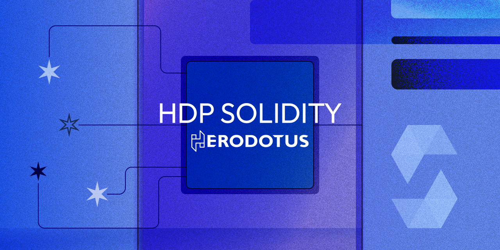

# HDP Solidity


> **Warning**: This codebase is experimental and not audited. Use at your own risk.

## Introduction

The HDP Solidity contracts interface with the Herodotus Data Processor (HDP) to authenticate and store processed results securely on-chain. These contracts facilitate complex data processing tasks and result in validation using cryptographic proofs. For more, visit our [documentation](https://docs.herodotus.dev/herodotus-docs/developers/herodotus-data-processor-hdp).

## Deployed Contracts

- [Deployed Contracts Addresses](https://docs.herodotus.dev/herodotus-docs/developers/herodotus-data-processor-hdp#contract-addresses)

## Contract Overview

`HdpExecutionStore` is the main contract in this project. It manages the execution and verification of computational tasks on various datalakes like block-sampled, transactions in block datalake. The contract integrates multiple functionalities:

- **Task Scheduling and Result Caching**: Allows scheduling of tasks and caching of intermediate and final results.
- **Merkle Proof Verification**: Utilizes Merkle proofs to ensure the integrity of task results and batch inclusions.
- **Integration with External Fact Registries and Aggregators**: Verifies task computations against a set of pre-registered facts using the SHARP Facts Registry and coordinates with data aggregators.

### Key Functions

- `requestExecutionOfTaskWithBlockSampledDatalake()`: Schedules computational tasks using block-sampled data lake.
- `requestExecutionOfTaskWithTransactionsInBlockDatalake()`: Schedules computational tasks using transactions-in-block data lake.
- `authenticateTaskExecution()`: Verifies and finalizes the execution of computational tasks by validating Merkle proofs and registered facts.
- `getFinalizedTaskResult()`: Retrieves results of finalized tasks.

## External Contracts

- **FactsRegistry**: Manages facts for task verification. [More info](https://github.com/starkware-libs/starkex-contracts/blob/master/scalable-dex/contracts/src/components/FactRegistry.sol)
- **SharpFactsAggregator**: Aggregates jobs [More info](https://github.com/HerodotusDev/offchain-evm-headers-processor/blob/main/solidity-verifier/src/SharpFactsAggregator.sol)
- **AggregatorsFactory**: Factory pattern to create data aggregators. [More info](https://github.com/HerodotusDev/offchain-evm-headers-processor/blob/main/solidity-verifier/src/AggregatorsFactory.sol)

## Data Structures

### Data Lakes

- **BlockSampledDatalake**:

  - Structure used for defining data samples over a range of blocks.
  - Encoded through `BlockSampledDatalakeCodecs` which manages the serialization and commitment of the data structures.
  - `commit()` function creates a hash of the encoded datalake, used for verifying integrity and registering tasks.

- **TransactionsInBlockDatalake**:
  - Structure used for defining transactions included in the target block.
  - Encoded through `TransactionsInBlockDatalakeCodecs` which manages the serialization and commitment of the data structures.
  - `commit()` function creates a hash of the encoded datalake, used for verifying integrity and registering tasks.

### Computational Tasks

- **ComputationalTask**:
  - Defines tasks that perform aggregate functions on the data retrieved from datalakes.
  - Encoded and committed using `ComputationalTaskCodecs`, ensuring that tasks are securely and efficiently processed.
  - Supported functions include average, sum, min, max, count, and Merkle proof aggregation, with various operators for conditional processing.

## Codecs

### Key Codec Functions

- `encode()`: Serializes data structures for transmission or storage.
- `commit()`: Generates cryptographic commitments of data, essential for task verification and integrity checks.
- `decode()`: Converts serialized data back into structured formats.

## Getting Started

Pre-requisites:

- Solidity (with solc >= 0.8.4)
- Foundry
- pnpm

## Deployment

Make sure to have a `.env` file configured with the variables defined in `.env.example`, then run:

```sh
source .env; forge script script/HdpExecutionStore.s.sol:HdpExecutionStoreDeployer --rpc-url $DEPLOY_RPC_URL --broadcast --verify -vvvv --via-ir
```

## Quick Start

For one time `hdp` binary installation:

```sh
make hdp-install
```

For one time local Cairo environment:

```sh
make cairo-install && make cairo1-install

```

To get Cairo PIE that is used in testing, run:

```sh
make cairo-run
```

Now can run the test from the setup above:

```sh
# Install submodules
forge install

# Build contracts
forge build

# Test
forge test
```

## Test with different Cairo Program

To test with different version of [cairo program](https://github.com/HerodotusDev/hdp-cairo), compile it and locate it in [build/compiled_cairo/](build/compiled_cairo/).

## Test with different input

Utilize command:

```sh
make hdp-run
```

If want to fetch different input, generate `input.json` and `output.json` using [hdp cli](https://github.com/HerodotusDev/hdp) or you can get them from [hdp-test fixtures](https://github.com/HerodotusDev/hdp-test/tree/main/fixtures).

Modify input and output files that are located in `build/compiled_cairo/`. Also, in the test file, construct thecorresponding datalake and task instance before initiating.

And run the test for modified request:

```sh
# Test
forge test
```

## License

`hdp-solidity` is licensed under the [GNU General Public License v3.0](./LICENSE).

---

Herodotus Dev Ltd - 2024
